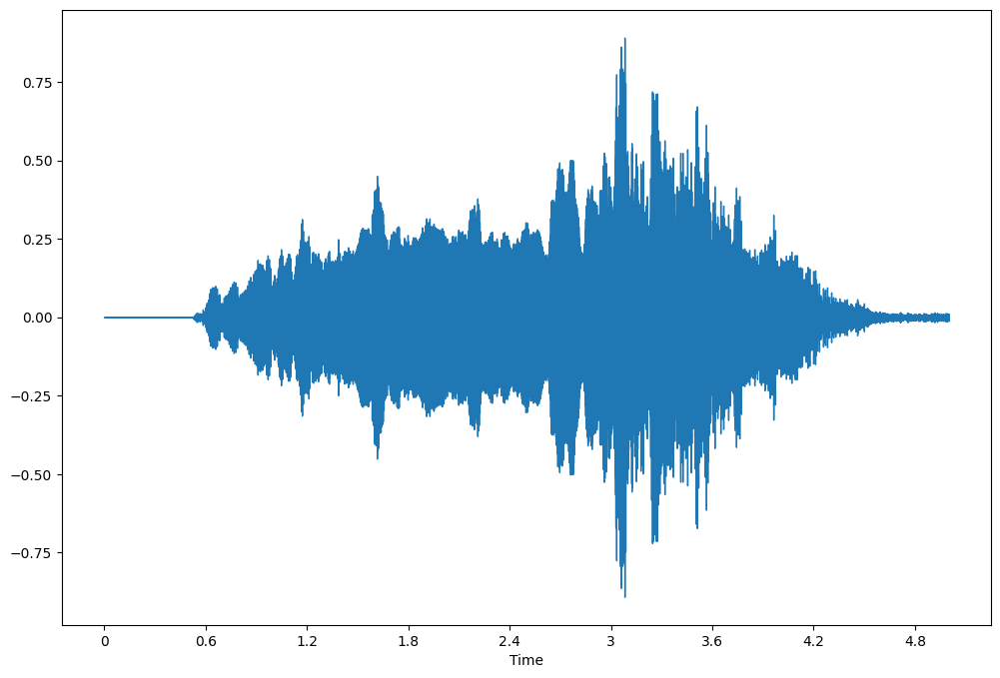

# Homework 2: Speech Analysis & Feature Extraction

## Introduction

In this homework, I follow [the Jupyter notebook provided by the course instructor](https://colab.research.google.com/drive/154BMGp1PfaUGcNBm2gqfaFfWjznXP0QK) to learn speech analysis and feature extraction.

## Speech Analysis and Feature Extraction

Instead of using the audio from the `get_audio` function, I load my 5-second voice `mono.wav`, which I record when doing homework 1, and do the following analysis and feature extraction with either *librosa* or *Parselmouth*.

- Viewing the waveform (*librosa*)
- Viewing the spectrogram (*librosa*)
- Pitch tracking (*librosa*)
- Resampling (*librosa*)
- Viewing the narrowband and the wideband spectrograms (*librosa*)
- Plotting pitch contour (*Parselmouth*)
- Viewing the mel spectrogram (*librosa*)
- Extracting MFCCs (*librosa*)

In addition, time-stretching and pitch-shifting appear in this homework again. This time, the pitch contours of the original and the resultant audio are plotted on the spectrograms.

### Waveform

In homework 1, the waveform is shown by *Audacity*. In this homework, the waveform is shown by the function `librosa.display.waveshow`.

Figure. The waveform of my voice.

### Spectrogram

The function `librosa.display.specshow` shows the spectrogram of my voice. The first parameter of the function is the absolute values of the STFT of my voice.

Figure. The spectrogram of my voice.

It is interesting to see that the recorded voice contains no components of frequencies higher than 8 kHz.

### Pitch Tracking

The function `librosa.piptrack` is applied to my voice to find local maxima in the spectrogram. By default, it only outputs values to frequency $f$ Hz with $150 \le f \lt 4000$.

Figure. The result of librosa.piptrack applied to my voice.

### Resampling

*Sox* resamples the audio in homework 1; *librosa* resamples the audio in homework 2. The function `librosa.resample resamples the samples given the original and the target rates, which are respectively 44.1 kHz and 16 kHz.

Figure. The spectrograms of my voice before and after resampling.

### Narrowband and Wideband Spectrograms

In homework 1, I manually pick 1024 and 128 as the number of data point or `n_fft` to do FFT for each narrowband and wideband spectrograms, such that the bandwidth is about 45 Hz and 300 Hz. In this homework, the course instructor originally sets 2048 and 128 as `n_fft`, which makes the bandwidths 7.812 Hz and 125.000 Hz, respectively.

Figure. The narrowband and wideband spectrograms.

### Pitch Contour

Figure. The spectrogram of my voice with a pitch contour.

### Mel-Scaled Spectrogram

Figure. The linear and mel scale spectrograms of my voice.

### MFCCs

Figure. MFCCs of my voice.

## Time-Stretching and Pitch-Shifting

I have used Rubber Band to time-stretch and pitch-shift an audio in homework 1, and here I use it again and then plot spectrograms and pitch contours for both original and resultant audio.

Figure. The spectrograms of my voice and Rubber-Banded voice with pitch contours.
